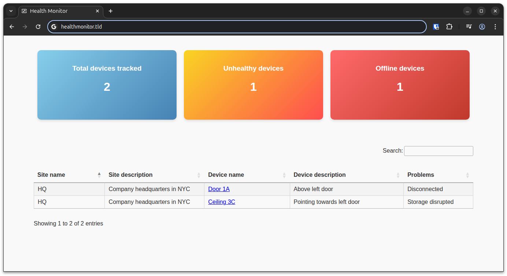

# YourSixOS Webhook Example: Health Monitor

YourSix are often asked if we provide any API as part of YourSixOS. Many times,
the needs for an API can be satisfied using the webhook functionality of
YourSixOS. A typical request is: "can we poll health data from YourSixOS?". The
answer is _no_, but we can send the data to you instead; immediately when
there's a change in health state. This adheres to the pattern of event-driven
architecture, and the way we deliver events to third party systems is via
webhooks (HTTP requests going from YourSixOS to the third party system).

This repository holds an example that demonstrates how to use the YourSixOS
webhooks to monitor the health of devices. YourSixOS event notifications are
received as webhooks; the payloads are parsed and indexed in a PostgreSQL
database, and visualized via a small HTML5/JavaScript application.

## Dataflow

In essence, the dataflow between YourSixOS, Health Monitor and the browser looks
as follows.

What the diagram does not depict is that Health Monitor is both acting as
backend and serving out the static single-page application (frontend).

    ┌───────────┐  Webhook  ┌────────────────┐      ┌────────────┐
    │ YourSixOS ├──────────►│ Health Monitor │─────►│ PostgreSQL │
    └───────────┘           └────────────────┘      └────────────┘
                                    ▲
                                    │
                                    │
           ┌─────────┐     HTTP     │
           │ Browser |──────────────┘
           └─────────┘

## Architecture

Health Monitor consists of a backend receving webhooks over HTTP(S) from
YourSixOS. The backend sources the events received as webhooks to build a
database of devices.

The database is served out as a REST API, and consumed by the frontend designed
as a single-page application (SPA).

The backend application, written in Golang, serves the webhook receiver, the API
and the static webserver hosting the SPA.

## Run locally and contribute

Using Docker and Docker Compose, setting up a local stack with database, backend
and frontend is as easy as:

    $> cd tools
    $> docker compose up

Open your browser at http://localhost:8000

When set up locally, Vite is configured to proxy `/api` into the backend when
running Vite's built-in development server, as follows:

    $> npm install
    $> npm run dev

Testdata is available in the `tools/testdata` directory and can be ingested
with curl:

    $> curl -d @disconnected.json http://localhost:8000/webhook

## How to deploy

While we only provide this application code as an example on how to consume
webhooks from YourSixOS, there is a Docker composition in the `deploy`
directory.

The deployment composition deploys the following containers:

* Health Monitor: The application itself
* PostgreSQL: Database for device model
* Caddy: Reverse proxy for HTTPS and basic authentication

To deploy the stack, you need a VPS, EC2, Azure VM or similar machine with:

* A publicly routable IP address
* An FQDN pointed to it
* Ports TCP 443 and TCP 80 open

Run the following commands on the machine to set up the entire stack:

    $> git clone https://github.com/yoursixinc/webhook-example-healthmonitor
    $> cd webhook-example-healthmonitor/deploy

Edit the placeholders in the `Caddyfile` to match your FQDN, desired username
and desired password, as well as the `docker-compose.yml` to match your desired
database username.

Run the following command to stand the stack up:

    $> docker compose up -d

Deploying the application expect Docker and Docker Compose to be available.
Refer to the [official Docker documentation](https://docs.docker.com/engine/)
to set up Docker and Docker Compose.

Once the stack is set up, head into YourSixOS and set up an organization webhook
(Edit Organization -> Webhook), using the URL
`https://healthmonitor.example.com/webhook`. Set up a notification rule that
subscribes to health events from relevant scopes and send them to that webhook.
Disconnect a device to synthetically trigger an event and observe as it gets
visualized in the Health Monitor application.

## Disclaimer

This application is provied as-is without any guarantees or warranty. Use of
this application is at your sole discretion and risk. If the subject matter is
not fully understood, it is recommended to refrain from use.
